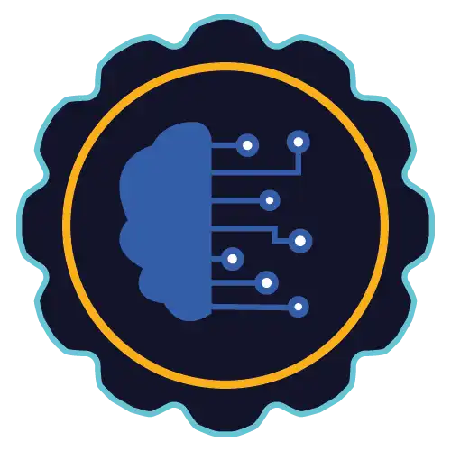

    <h1>Bootcamp Nexa - Machine Learning para Iniciantes na AWS</h1>

  

    
                   

  

  

     
  

    
    

  

    
    

 

<h3>10 horas | 10 cursos | 1 desafios de projeto | 1 desafios de código | 1 lives</h3>

## Introdução
Olá,

Esse repositório corresponde ao projeto "Inteligente na AWS com Sagemaker Canvas" da [DIO - Digital Innovation One](https://www.dio.me/).

## Objetivo

Esse projeto da DIO, tivemos a oportunidade de aplicar conceitos práticos de Machine Learning (ML) utilizando o SageMaker Canvas para criar previsões de estoque. 

Explorado todos os conceitos que aprendemos nesse bootcamp.

### 1. Selecionar Dataset

-   Navegue até a pasta `datasets` deste repositório. Esta pasta contém os datasets que você poderá escolher para treinar e testar seu modelo de ML. Sinta-se à vontade para gerar/enriquecer seus próprios datasets, quanto mais você se engajar, mais relevante esse projeto será em seu portfólio.
-   Escolha o dataset que você usará para treinar seu modelo de previsão de estoque.
-   Faça o upload do dataset no SageMaker Canvas.

### 2. Construir/Treinar

-   No SageMaker Canvas, importe o dataset que você selecionou.
-   Configure as variáveis de entrada e saída de acordo com os dados.
-   Inicie o treinamento do modelo. Isso pode levar algum tempo, dependendo do tamanho do dataset.

### 3. Analisar

-   Após o treinamento, examine as métricas de performance do modelo.
-   Verifique as principais características que influenciam as previsões.
-   Faça ajustes no modelo se necessário e re-treine até obter um desempenho satisfatório.

### 4. Prever

-   Use o modelo treinado para fazer previsões de estoque.
-   Exporte os resultados e analise as previsões geradas.
-   Documente suas conclusões e qualquer insight obtido a partir das previsões.
  

## Próximos passos

Continuar o evoluindo no estudo no Sagemaker Canvas e outras ferramentas da AWS para futuros projetos e aplicações. 

## Tecnologias Utilizadas

## Cursos Envolvidos
### **Bootcamp Nexa - Machine Learning para Iniciantes na AWS** 
#### **Machine Learning Sem Código com Amazon SageMaker Canvas:**
- Previsão de Estoque Inteligente na AWS com Sagemaker Canvas

## Agradecimentos
Gostaria de agradecer a [DIO - Digital Innovation One](https://www.dio.me/) e ao instrutor [Venilton FalvoJr](https://github.com/falvojr) por compartilhar seu conhecimento.
